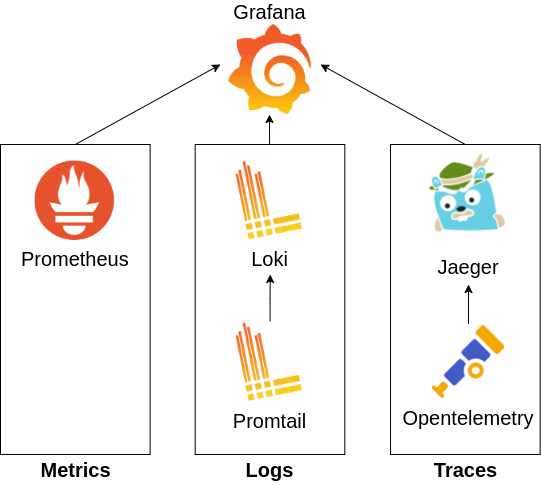

Metrics, Logs and Traces (MLT) are the three pillars of monitoring that can give us a complete observability of a system.

In this article we're going to set up all three of MLT on a kubernetes platform to monitor a app made with microservices.
## What are metrics, logs and traces?

#### Metrics 
Metrics show the measure of how the system is used. Typically they are shown in numbers or graphs. For example-
* How much cpu was used the past hour?
* How much storage is consumed?
* How much bandwidth is left?

#### Logs
Logs are events that a running software records. For example-
* Log the stack trace of a runtime error
* Log when a user accesses the system

#### Traces
Traces shows the path of a programs execution. In a modern distributed system, a request from client may get processed by several services. It is important to know through which path a request got processed and how much time was needed in each individual nodes so that bottlenecks can be identified.

## Technologies required

Implementing all of this requires a bunch of different technologies. It's easy to get lost, so take it easy. Let's introduce the technoligies we're gonna use.

1. **Grafana** _[Dashboard]_: This is a central dashboard where we will observe every MLT data collected by different services
2. **Prometheus** _[Monitoring]_: This collects kubernetes/pods/containers metrics (CPU, Memory, Bandwidth, etc) and sends them to grafana
3. **Promtail** _[Logging]_: This collects log data from containers
4. **Loki** _[Logging]_: This aggregates and stores all logs collected by Promtail and forwards them to Grafana
5. **Opentelemetry** _[Tracing]_: This is used to instrument an app to collect traces and then forward them to Jaeger
6. **Jaeger** _[Tracing]_: This collects tracing information for viewing. It can also optionally send them to grafana

The following figure summarizes our implementation.


## Installation

We usually make deployments in Kubernetes throuh yml files containing our preferred deployment. However, writing such deployment files are difficult and time consuming when you're not an expert. Fortunately there is **[Helm](https://helm.sh/)** which is a sort of package manager for Kubernetes. With helm programs can be installed in a Kubernetes cluster through a few commands.

In this tutorial we will be using helm for our deployments.

#### Install Helm

```bash
$ sudo snap install helm --classic
```

Or try another method from their [official docs](https://helm.sh/docs/intro/install/)

#### Install MLT

The procedures in this section have been made by following these official docs:
* [grafana.com](https://grafana.com/docs/loki/next/installation/helm/)
* [github.com/jaegertracing](https://github.com/jaegertracing/helm-charts)

```bash
helm repo add grafana https://grafana.github.io/helm-charts
helm repo add jaegertracing https://jaegertracing.github.io/helm-charts
helm repo update

helm upgrade --install loki grafana/loki-stack,  \
             --set grafana.enabled=true, \
             prometheus.enabled=true, \
             prometheus.alertmanager.persistentVolume.enabled=false, \
             prometheus.server.persistentVolume.enabled=false, \
             loki.persistence.enabled=true, \
             loki.persistence.storageClassName=standard, \
             loki.persistence.size=5Gi

helm upgrade --install jaeger jaegertracing/jaeger
```

That's it! Give it a few minutes and everything should be installed. Before installation, make sure you have enough resources in the cluster for allocation.

More config values to use in the CLI for helm can be found at the following:
* [Base config (grafana/loki-stack)](https://github.com/grafana/helm-charts/blob/main/charts/loki-stack/values.yaml)
* [Grafana](https://github.com/helm/charts/blob/master/stable/grafana/values.yaml)
* [Loki](https://github.com/grafana/loki/blob/main/production/helm/loki/values.yaml)
* [Promtail](https://github.com/grafana/helm-charts/blob/main/charts/promtail/values.yaml)
* [Prometheus](https://github.com/helm/charts/blob/master/stable/prometheus/values.yaml)
* [Jaeger](https://github.com/jaegertracing/helm-charts/blob/main/charts/jaeger/values.yaml)

## Configuring the Programs

Coming soon!

<details>
    <summary>Legacy config</summary>

```bash
# Install prometheus
helm repo add prometheus-community https://prometheus-community.github.io/helm-charts
helm install prometheus prometheus-community/prometheus
kubectl expose service prometheus-server --type=NodePort --target-port=9090 --name=prometheus-server-np

# Install grafana
helm repo add grafana https://grafana.github.io/helm-charts

helm install grafana grafana/grafana --set persistence.enabled=true,persistence.type=pvc,persistence.size=10Gi 

kubectl expose service grafana --type=NodePort --target-port=3000 --name=grafana-np

# Use the password provided by this to login
kubectl get secret --namespace default grafana -o jsonpath="{.data.admin-password}" | base64 --decode ; echo

# Install loki
helm repo add loki https://grafana.github.io/loki/charts
helm repo update

helm upgrade --install loki loki/loki-stack --set grafana.enabled=true

helm install loki-stack grafana/loki-stack \  
                                --create-namespace \  
                                --namespace loki-stack \                                
    --set promtail.enabled=true,loki.enabled=true,loki.persistence.size=100Gi
```
</details>